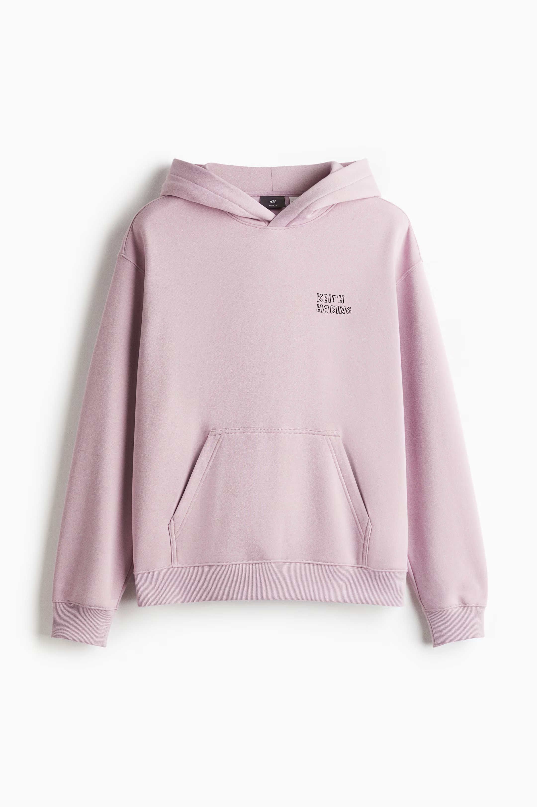
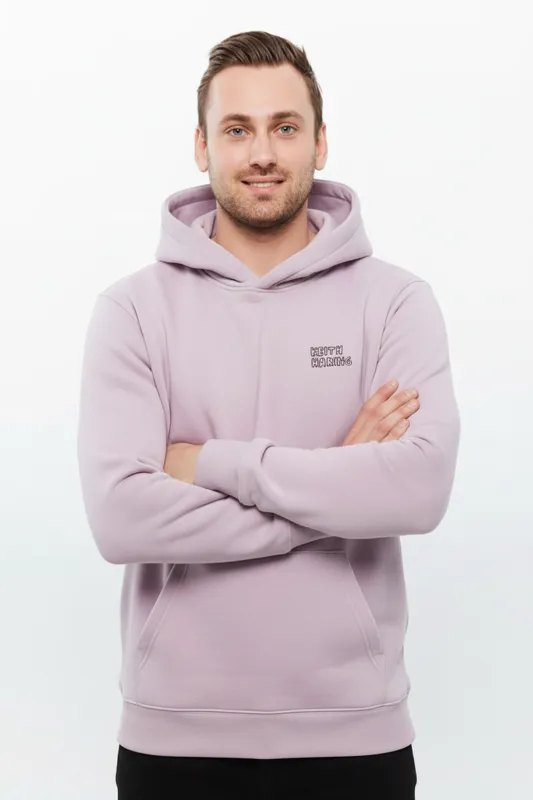
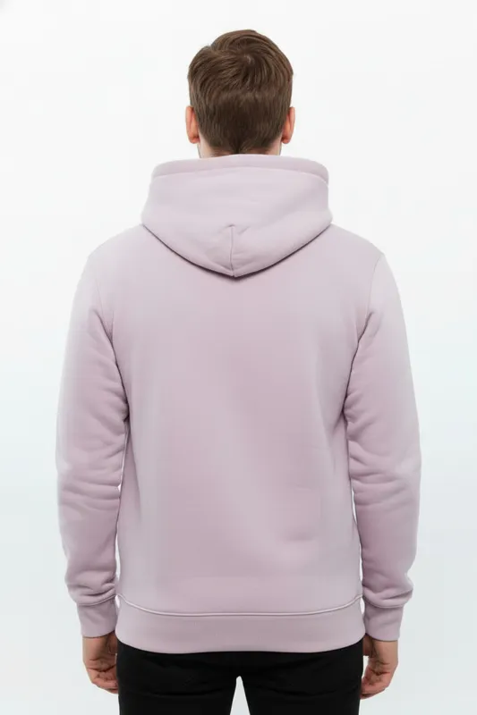
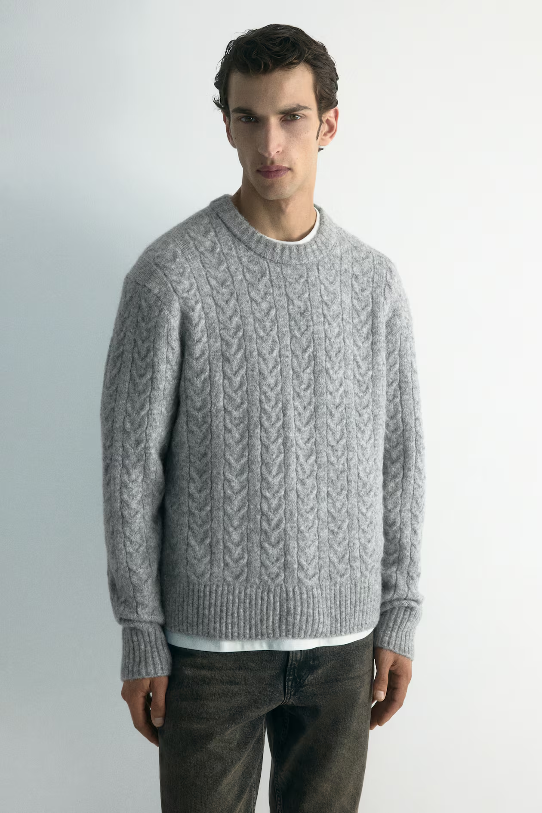
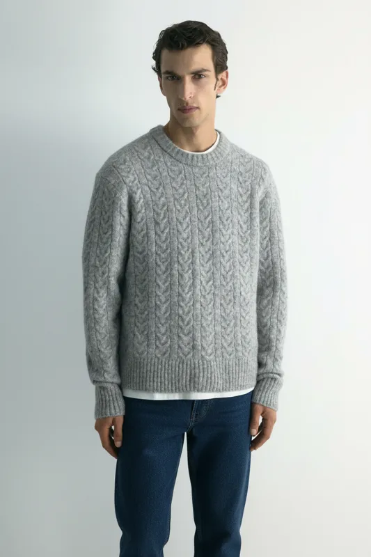
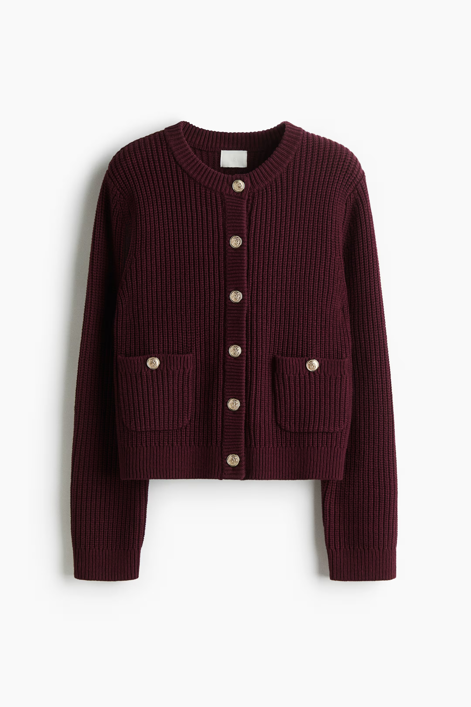
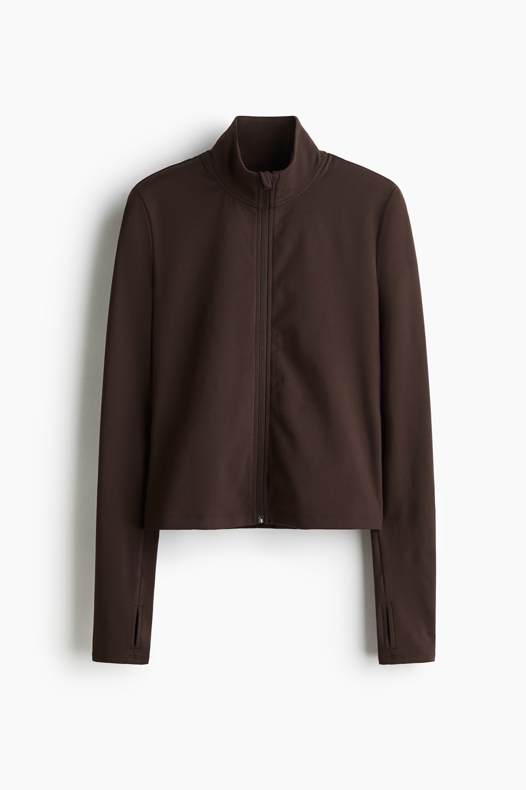
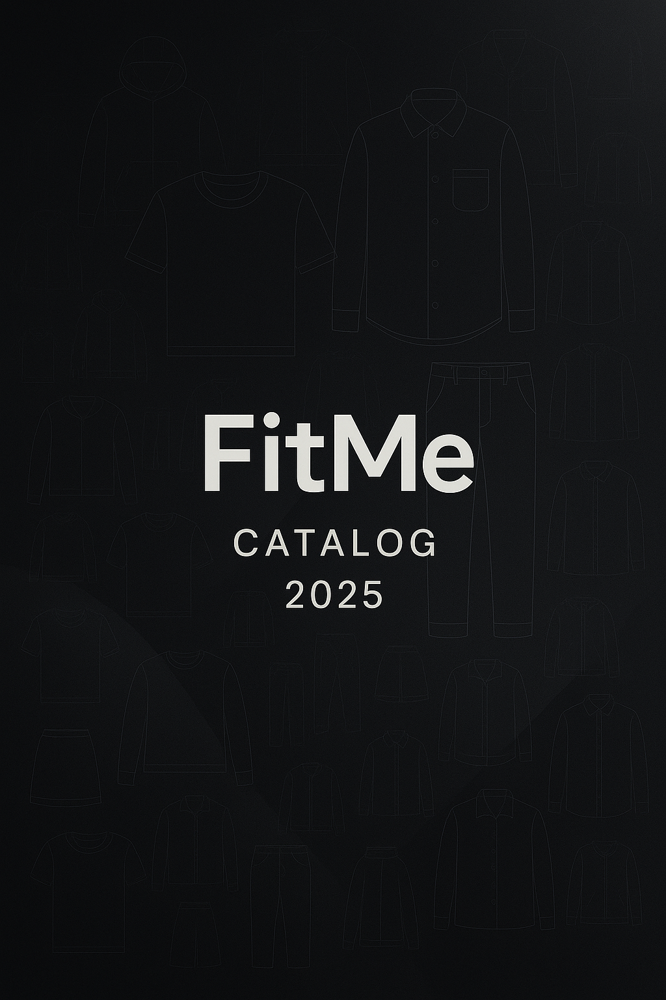
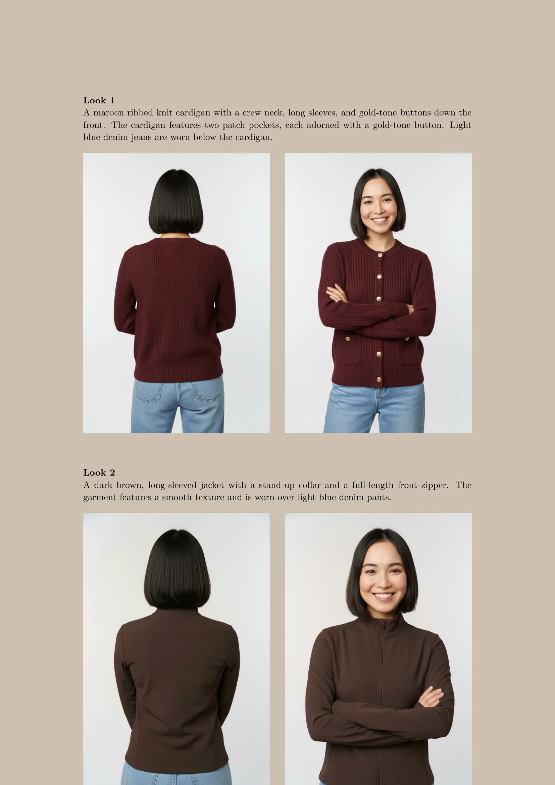
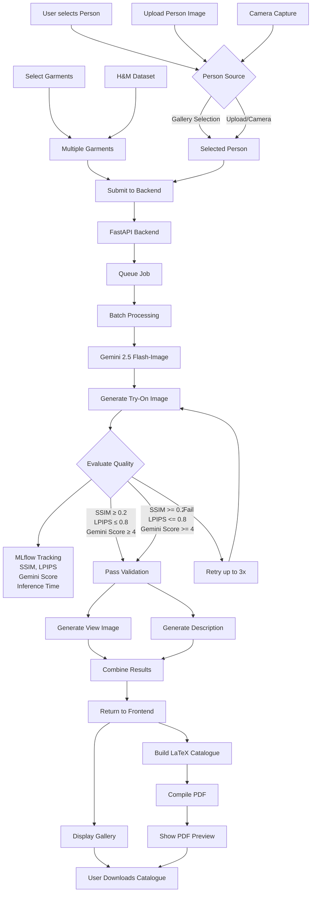

# Fit-Me Virtual Try On 
[](https://github.com/matildaronder/Fit-Me/actions/workflows/ci.yml)


## Authors 
- Matilda Ronder
- Jacob Danielsson
- Gustav Pråmell


## 1. Project Overview
This project implements a Virtual Try-On (VTON) system that generates realistic try-on images by combining:    
Input:
- Photo of user  
- Photo of garment or collection of garments

Output:  
- New image with the garment applied to the user.
- An description or descriptions of the garment/s worn by the user.
- An alternative view from the backside of the user wearing the garment
- A Latex-generated pdf catalogue

The application is build with Gradio, allowing users to upload images from device or use camera for a live photo. Input a picture of yourself or another person, choose the garments and run the FitMe mode. Enjoy the generated outputs in the beautiful cataloge generated by the system. 

The system is ideal for:
- Trying on garments
- Fashion research
- Apparel e-commerse prototyping
- Automated outfit catalogues

## 2. Motivation / Real-World Problem
Buying clothes online can be be a struggle, difference from the garment on picture compared to in real life, different sizes and a varity of fabrics. This leads to the problem of you may want see how the clothes you are looking at will look on yourself before making your final decision and purshasing it. 
This problems leads to people ordering home clothes with the only purpose of trying them on and returning what they do not like. The returning processes can be misleading from companies were it is cheaper for the companies to just throw away the clothes than to sell them again [Article](https://www.lunduniversity.lu.se/article/where-do-your-online-shopping-returns-end-bin-new-research-finds).
According to the UN Environment Programme, the fashion industry is the second largest water consumer in the world. [Article-Water](https://www.unep.org/news-and-stories/press-release/un-alliance-sustainable-fashion-addresses-damage-fast-fashion).
Instead of buying clothing online and try them out at home and return them if they dont fit, FitMe provides an alternative solution to the visualization of the garments on yourself were FitMe can help customers to try the clothes before ordering. This helps  environment through less deliveires and returns, companies can handle fewer returns and customers can enjoy good looking clothing. 

There are a few models that are present in the area of virual try-on like the IDM-VTON [HuggingFace](https://huggingface.co/spaces/yisol/IDM-VTON) model which has the cabability of generating an upper garments like tops,sweaters,t-shirts on a person. The IDM-VTON model performed well on this task and provided the expected result we wanted for FitMe but with one problem, that the IDM-VTON is not capable of generating lower body garments like pants,shorts. This model are also very compute heavy requiring a GPU with over 24GB of VRAM. This was possible to solve by running the model on provided servers but inference times were still high per generated image (> 30s), this together with the lacking ability to provide a fully operational clothing solution this model were not selected.
Additional State of the art image generating models were considered like [Claude Vision](https://platform.claude.com/docs/en/build-with-claude/vision), [OpenAIs Dall-E](https://openai.com/index/dall-e-3/) and [Google Gemini](https://ai.google.dev/gemini-api/docs/models) models with cost and additional verification for the Claude and OpenAi models led to the selection of the Gemini models. The inference time compared for a full run of a single garment with one additional view generated and a description differentiated by:  
### Gemini 2.5
- **SSIM:** 1.00
- **LPIPS:** 0.5658
- **Gemini Eval Score:** 10
- **Try-on Results:** 1
- **Views:** 1
- **Inference Time:** 33.63 seconds

### Gemini 3
- **SSIM:** 1.00
- **LPIPS:** 0.5916
- **Gemini Eval Score:** 10
- **Try-on Results:** 1
- **Views:** 1
- **Inference Time:** 44.17 seconds

This shows that Gemini 3 had a slight edge in the lpsis test compared to the gemini 2.5 models but this resulted in a ~11s increase in runtime. More about the metrics used and how it is being tracked can be found in [Metrics](#12-metrics-tracking).
 
The choice were the Gemini 2.5 models which has both a image generation model and a text model via their API services. The newly released Gemini 3 models were released during this project but due to higher cost and longer inference times compared to the 2.5 generation models, these were selected and used for FitMe. 

By choosing the Gemini models it gave the project the ability to harness the models ability to generate both upper and lower garment try on but also the ability to generate an description to visually describe the image. Together with the usage of the model to generate an alternative view of the try on image for a more detailed visualization of the full perspective of try on to the user. This together with the fast inference times is the reason that FitMe can provide a realistic try on to the user within a few seconds.

## 3. How the Program Work

### 3.1 User Interface
- **Gradio**  
The user interacts with a graphical interface where they can choose:
- Gender Mode:
    - Male 
    - Female
      
This selects the preview of the available clothing provided by FitMe currently (HM).

- Person Mode: 
    - Select Person (Select one of our models)
    - Upload Person (Upload yourself through directory or your camera)
- Garment Input:
    - One or multiple images of garment (only garment, worn garments on persons not currently supported)
- Person image:
    - A single image of a person (.jpeg, .jpg, .png)

Once the inputs are choosen by the user and loaded by the system, the user run the virtual try on by pressing the button 'Generate-Try-On'.


- **Generate Try On Button**
      - Starts the virtual try on when Person and Garment input are present.
- **Generate Catalogue Button**
      - Creates a stylish catalogue from the generated images utilizing the tryon image,alternative view and description.

This starts FitMe. The status of your work is seen in the backend:
### RETURN STATES

- **RUNNING**  
  - Your request is handled by the system and will be displayed soon

- **DONE**  
  - Your request is completed and presented in the GUI

- **QUEUED**  
  - Your request will soon be handled by the system

- **ERROR**
  - "Error: Upload a profile image"  (No person image selected)
  - "Error: Upload at least one garment image"  (No garment image selected)
  - "Error: backend failed"  (FitMe server error, contact FitMe)
  - "Status: Connection Error: {error}"  (Network error)
  - "Error: No results"  (FitMe server error, contact FitMe)  


### 3.2 Inference Pipeline
The inference pipeline is a multi-stage system that connects the Gradio UI to the FastAPI backend:

1. **Frontend Submission** (app.py):
   - User selects a person (from gallery or uploads with camera)
   - User selects one or more garment images
   - User clicks "Generate Try-On" button
   - Input validation ensures both person and garment images are present

2. **Backend Processing** (inference-service.py or inference-service-realtime.py):
   - Job submitted to FastAPI backend with encoded person and garment images
   - Job queued with status QUEUED
   - Batch worker processes job: status changes to RUNNING
   - Gemini API generates virtual try-on images with garment on person
   - Backend stores results and marks job as DONE (or ERROR if failure)

3. **Result Handling** (app.py):
   - Frontend polls backend for job status at regular intervals
   - When job completes, results fetched and decoded from JSON
   - Generated images displayed in Gradio gallery
   - Images automatically saved to user-specific directory: `data/results/{USER_SESSION_ID}/`
   - Catalogue generator scans results and creates PDF with descriptions

4. **Multi-User Isolation**:
   - Each user session gets unique ID
   - Results stored in isolated user directories

### 3.3 Pre-trained Models
Image Generation Model
- [Google Gemini 2.5 flash-image](https://developers.googleblog.com/introducing-gemini-2-5-flash-image/)
The model that is used for generate the new images are Google Gemini. Multiple diffusion models were evaluated (OpenAi ChatGPT, Claude Vision, Gemini). Because of the complications of using OpenAi:s image generations model with id verification and higher cost for both this and Claude Vision, led to the selection of Google Geminis models being used. This model provided quick and good results from our testing. This model handles the generation of the try on images for FitMe but also the alternative view image of the user.
Description Models
- [Google Gemini 2.5 flash](https://docs.cloud.google.com/vertex-ai/generative-ai/docs/models/gemini/2-5-flash)
This model is used to generate the desription or descriptions of the garments for the users. This model output were adapted to fit FitMes description likings by prompt engineering.
- LLaVa [HugginFace](https://huggingface.co/fancyfeast/llama-joycaption-beta-one-hf-llava)
LLava was used when the desktop variant (Tkiner) were implemented this used if avaiable and sufficent GPU memory to generate the description of the garments locally. Saving on used tokens on the cloud models.

### 3.4 Catalogue generation
Once the new images are saved:
1. The script catalogue() scans the data/results folder.
2. It builds a freash catalogue.tex document containing:
    - Catalogue front page
    - Generated image/s.
    - Alternative view of the generated image/s.
    - A description of every image
3. The previous catalogue.pdf is deleted on startup.
4. A new catalogue.pdf is generated using pdflatex
The user ends up with a clean, updated PDF catalogue for every new run.

## 4. Data
- The supplied data from FitMe is from a limited webscraping of different catagories from HM both male and female for diversity.
- The garments supplied are a single frontal view with a white background.
- Users of FitMe can supply both their own person image and garment images.

## 5. Image Evaluation Metrics
Generated virtual try-on images are evaluated using multiple quality metrics to ensure realism and proper garment transfer:

1. **SSIM (Structural Similarity Index)**
   - Compares structural similarity between generated image and garment reference
   - Measures pixel-level correlation and patterns
   - Pass threshold: >= 0.2

2. **LPIPS (Learned Perceptual Image Patch Similarity)**
   - Measures visual similarity between generated and reference images
   - Trained on human perceptual judgments for realistic results
   - Lower scores indicate higher visual quality
   - Pass threshold: <= 0.8

3. **Gemini AI Quality Score**
   - Evaluates quality of garment transfer using Gemini 2.5 Flash vision model
   - Assesses realism of fit and alignment on the person
   - Returns numerical score between 0-10
   - Pass threshold: >= 4

4. **Multi-Metric Validation**
   - Image passes evaluation only if ALL metrics meet thresholds:
     - SSIM >= 0.2 AND LPIPS <= 0.8 AND Gemini score >= 4
   - Failed images trigger automatic retry (up to 3 retries)
   - Ensures only high-quality results are presented to users

These threshholds are a system to improve the returned images to match the quality the user expect. This by utilizing a vararity of evaluation metrics to find and retry NOK generated images to a OK image.
Improvements in evaluation techniques will be dicussed further in future works. 

## 6. Application Goal
The goal of this application is to:
- Produce realistic try-on results
- Maximize visual output from model through from evaluations [in](#5-image-evaluation-metrics). 
- Ensure garment truth and body alignment (color, shape, pattern)
- Low system latency 

## 7. How to use the program
### 7.1 Clone Project
```
git clone https://github.com/matildaronder/Fit-Me.git
cd Fit-Me
```
### 7.2 Get an Google API key
[Google API Key](https://ai.google.dev/gemini-api/docs/api-key)
### 7.2 Add this to an .env file in /Fit-Me
```
API_KEY={YOUR_API_KEY}  
POSTGRES_USER={YOUR_USER}  
POSTGRES_PASSWORD={YOUR_PASSWORD}  
POSTGRES_DB={YOUR_DB_NAME}  
```
See .env.example for instructions.
### 7.2 Select Docker Compose

Choose the appropriate Docker Compose configuration based on your inference needs:

- **FAST INFERENCE**
  - `docker-compose.yml`  
  - Optimized for faster interaction between the **FitMe system** and **Gemini**.

- **CHEAPER INFERENCE**
  - Rename `DOCKER-RENAME-COMPOSE` to `docker-compose.yml`
  - Rename the existing standard `docker-compose.yml` to a different name  
  - This setup prioritizes lower inference cost over speed.
### 7.3 Build Docker 
```docker-compose build```
### 7.4 Run Docker Container
```docker-compose up -d```
### 7.5 Get Fit-Me URL
Wait a few seconds for system to start up before running:  
``` docker logs fit-me-site-1```  
To local URL (Running on local URL) and public URL (Running on public URL)

### 7.6 Enjoy the app
The FitMe app is now running on a public URL for you and your friends to enjoy.

## 8. Backend 
LOG LEVELS AND MESSAGE TYPES

The backend uses standard logging levels: DEBUG (detailed diagnostic info), INFO (general informational messages), WARNING (warning conditions), and ERROR (error conditions). Different environments and configurations determine which level of output is captured.

[DEBUG] messages are verbose, low-level information useful during development and troubleshooting. They include details like variable values, function entry/exit, timing information, and internal state. DEBUG is typically enabled in development but disabled in production to reduce log volume.

[INFO] messages are high-level informational messages marking important milestones or state transitions. These track user requests, job status changes, major processing steps, and success confirmations. INFO is suitable for production and gives operators visibility into normal system operation.

[WARNING] messages indicate unusual conditions that don't prevent processing but may indicate issues. Examples include retries due to quality validation failure, API timeouts, or missing optional files.

[ERROR] messages indicate conditions that prevent normal processing. These include API errors, file I/O failures, and exceptions that cause jobs to fail.

## 9. Expected input and output
### Single image T-Shirt Try On

<div align="center">




<p><strong>Description:</strong><br>
A light purple hoodie featuring a hood with adjustable drawstrings, long sleeves with ribbed cuffs, and a ribbed hem. A kangaroo pocket is visible at the front. The left chest area has a small black embroidered logo that reads "KEITH HARING". The hoodie is paired with black trousers.
</p>
</div>

### Pants Try on 

<div align="center">



</div>

### Multiple Images 
<div align="center">





<p><strong>Description:</strong><br>
A maroon ribbed knit cardigan with a crew neck, long sleeves, and gold-tone buttons down the front. The cardigan features two patch pockets, each adorned with a gold-tone button. Light blue denim jeans are worn below the cardigan.
</p>
</div>


<div align="center">





<p><strong>Description:</strong><br>
A maroon ribbed knit cardigan with a crew neck, long sleeves, and gold-tone buttons down the front. The cardigan features two patch pockets, each adorned with a gold-tone button. Light blue denim jeans are worn below the cardigan.
</p>

</div>

### Catalogue Example 

<div align="center">


</div>

## 10. System Architecture Flowchart


## 11. Conclusion and Reflection 
The goal of this project was to build a functional virtual try-on system using a pre-trained generative model. The core idea proved to be successful. This core idea were then expanded to increase the number of features that FitMe provides to also improve user experience and interaction with the system.

### Project Goal:
- Generate a realistic try on for a person with one or multiple garment images
Final System Capabilities:
- Generate a realistic try on for a person with one or multiple garment images
- Generate an or multiple additional views for the generated try on image.
- Describe the generated image/s.
- Serve inference interactively to multiple users through a publicly hosted Gradio UI.
- Ability to log system performance for continious follow up and improvements.
- Assemble the outputs (try-on images, view images and descriptions) into a catalogue.


### 11.1 Focus Areas of FitMe
#### 1. Model Quality
The evaluation metrics we use are a way on how FitMe is trying to ensure the quality of the returned images from Gemini. This was done by prompt engineering the prompt to the model to a standard which is currently used in Fitme.
Retries are a action FitMe takes for regeneration of badly generated images to the current thresholds. This is done up to 3 times because of API limits for current API licence.

#### 2. System Architecture
       The separation between these made the program easy to containerize which result in easy running and debugging.  
       - UI                     (Gradio)
       - Deployment             (Gradio)
       - API model wrapper      (Gemini)
       - Inference Backend      (FastAPI)
       - Inference logging      (MLFlow)
       - Catalogue generator    (pdfLatex)
       - Github Actions         (Build Testing)
    This gives a clear structure to continue working on and adding additional features or updating previous.
#### 3. Multi user
Fit-Me is designed from the ground up to support multiple users simultaneously in a safe, fair, and scalable way. Instead of processing user requests directly in the HTTP connection, every try-on request is converted into an asynchronous background job with a unique job ID. This allows the system to return immediately to the user while the job continues processing in the background. Users can poll for progress and results at any time, even if they leave and return later, which prevents long-running requests from blocking connections and enables many users to interact with the system concurrently.
On the backend, a fixed-size thread pool processes jobs concurrently. Multiple jobs can run in parallel, while additional jobs are queued and processed in a fair FIFO. This provides controlled concurrency and natural load balancing, allowing the system to scale to dozens of users without overwhelming server resources. To protect external services, API access is further regulated using semaphore-based rate limiting and enforced delays between requests. Only a limited number of API calls are allowed simultaneously, and retries with exponential backoff handle failures without blocking other users jobs.
###4. Cost
Cost were a factor in our additional inference mode the batching mode refered in [Here](#72-select-docker-compose). This mode uses the [Gemini batching](https://ai.google.dev/gemini-api/docs/batch-api?batch=file) API to reduce the costs of the API usage by combining multiple jobs into a single one and return those when finished to the corresponding users. 
#### 5. Throughput / Time
The throughput is most limiting by the API requests limit, this limits so the system can only send X requests per minute. The system tries to hold itself under this limit to not have the Gemini models return model overloaded. The jobs are instead batched in the backend and run when the previous job is done but this is handled by the FitMe backend not Google. In comparison the batching inference job handling are handled by Google and can increase inference time since it is dependent on the current demand on their servers. The most optimized version uses the singular inference API which is more expensive but faster which is the focus for this faster mode, to return the outputs faster back to the user but at a higher cost for FitMe. 

#### 6. Metrics Tracking
FitMe generates a set of parameters that can be used to evaluate the quality of the returned images and the overall system performance. These parameters enable continuous tracking and analysis, allowing results to be adapted and improved by adjusting behavior in response to varying evaluation metrics.

In addition to image quality assessment, these metrics can be monitored to evaluate performance across different usage scopes ranging from individual users to scaled multi user scenarios. FitMe also supports detailed operational tracking, including per API call metrics such as response times and processing duration. Together, these insights provide a foundation for performance optimization, scalability analysis, and ongoing quality improvements.

### 11.2 Limitations in current system
1. Ensuring Fit
The current model handles that the garments are present in the image to a good extent but a limitation is the fit of the garment on the person. This would require additional evaluations like pose estimation (OpenPose) to ensure person has the same pose in the generated image but it also can aid with how the garment are supposed to be fit on that pose.
2. Face Consistency
   A problem that the system has it that is has an tendency to alter the persons face in the generated image. To mitigate or solve this problem a FaceNet model could be use to keep face consistency in the generated image compared to the person image.
3. Description Quality
The current system has no evaluation on the generated description of the image, this because current testing has shown very successful but this should be implemented in upcoming sprints.
4. Scalability
   The usage of Gemini models generates the problem of scalability this because of the API limits of the Gemini models. 
5. Latency and Costs
Running via Gemini introduces:
    - Latency
    - Dependence on external avaliablity
    - API cost per image
6. Input Validation
The current system does not have any validation on the images that you send in over the correct image size, this   could be improved via image size limitations, image content etc..

7. Garment Input
The current system only handles images of garments singled out, the system cannot extract garments from a person wearing them. 

## 12 Future work
Future work should include the improved evaluation methods that were brought up in the [Limitations](#112-limitations-in-current-system). These evaluation methods has to be evaluated in quality and how they affect the systems performance. 

User Privacy (GDPR)
Due to the external dependency on the Gemini models the implementation of a anonymizer should be implemented to remove the image of the person before sent to Gemini and the reconstructed on the generated image to ensure privacy for the user.

### 12.1 Future Features
1. Model Generation
The current system has the capability of generating models for garment images instead of the current way of dressing a person in a garment. This could be useful for clothing companies to instead of send money on photoshots could use this feature to generate a catalogue for their clothing.

2. Suggested Week clothing
FitMe could introduce a week clothing feature were the user states their styles and provides images of themself and their vardrobe and the system evaluates the coming week for example weather,activities and style to come up with a suggestions on combination of the clothing from the users vardrobe for the week. 
